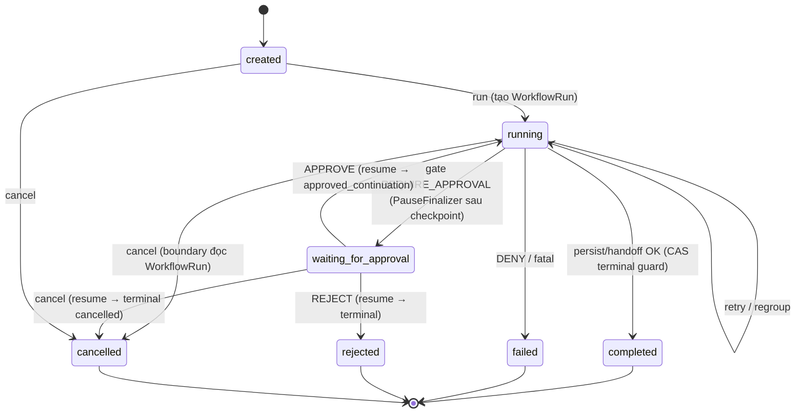
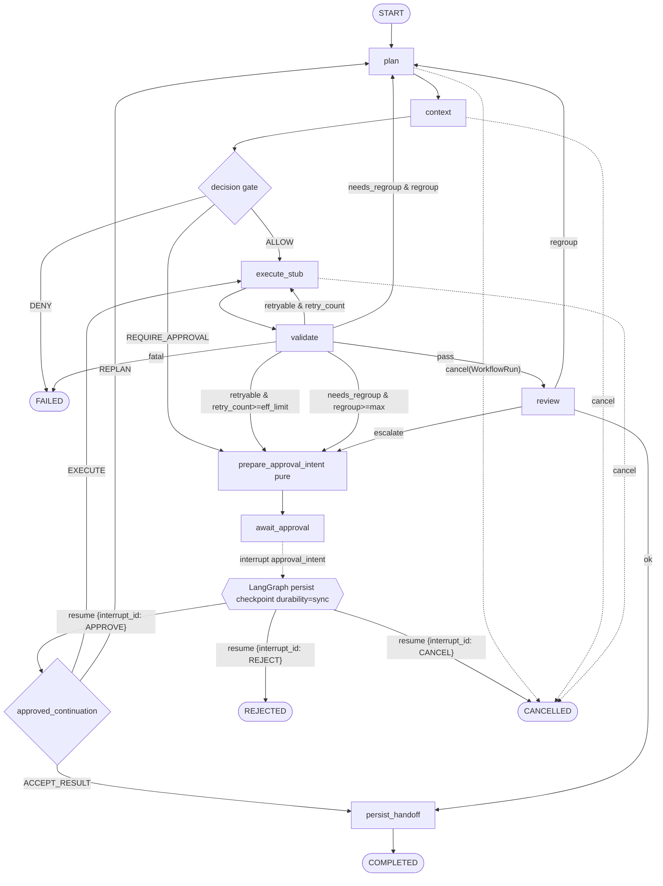
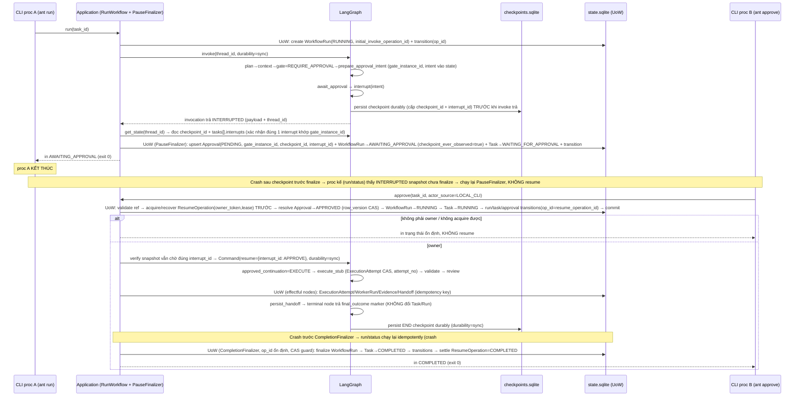

# PHASE 4 — LANGGRAPH WALKING SKELETON, CHECKPOINT & HUMAN APPROVAL — FINAL CANONICAL PLAN

> **Context.** Phase 3 (Execution Boundary + Context Package + Energy Enforcement) đã `COMPLETED` và
> merge (`703adaf`). Phase 4 dựng **walking skeleton workflow với worker stub** chạy qua LangGraph, có
> **durable checkpoint** và **human approval pause/resume bền vững qua restart process**. Đây **không**
> phải MVP end-to-end (execution vẫn là stub). **Đây là final canonical plan của Phase 4.**
>
> **Bản REVISED** đã sửa 14 vấn đề review; **FINAL PATCH** (§M) siết 11 điểm kiến trúc; **CANONICALIZATION
> MICRO-PATCH** (§N) khóa 6 điểm cuối: retry state canonical trong GraphState (effective **tính** =
> base+extension, không store); `approval_gate_sequence` chung + bỏ `rejected_continuation`; Task→RUNNING
> trong ResumeOperation UoW; `CompletionFinalizer` (`completion_operation_id`, hoạt động cả khi không có
> approval); `langgraph-checkpoint-sqlite >= 3.0.1` + `Interrupt.id`; dọn thuật ngữ. Các mục C–I **đã
> patch tại chỗ**; §M/§N là bảng truy vết.
>
> **Phạm vi task này:** *planning* — **KHÔNG** sửa `ROADMAP.md`, **KHÔNG** implement CP1, **KHÔNG** thêm
> code/dependency/test/migration. Bản này được lưu thành canonical
> **`docs/plans/PHASE_4_IMPLEMENTATION_PLAN.md`**.
>
> **Quyết định đã chốt với PO:**
> 1. LangGraph checkpointer trong file riêng **`.ant/checkpoints.sqlite`** (tách `state.sqlite`).
> 2. CLI approve/reject/cancel **định danh theo `task-id`** (invariant: mỗi task ≤ 1 active run + ≤ 1
>    pending approval).

---

## A. Executive assessment

**Phase 4 sẵn sàng bắt đầu: CÓ.** Baseline Phase 3 sạch (974 tests, gate 5/5 PASS). Hạ tầng tái dùng
được nhiều (xem §B). Bản revised siết lại các điểm đúng-đắn về phân tán/khôi phục:

- **Approval finalize SAU checkpoint** (PauseFinalizer đọc `langgraph_checkpoint_id` thật), không tạo
  Approval trước/độc lập với checkpoint → loại bỏ mâu thuẫn trong sequence/crash matrix.
- **Routing sau approval là dynamic** theo `ApprovalIntent.approved_continuation` (không hard-code
  `approve → execute_stub`).
- **Reject/Cancel đi qua graph**: persist decision → `Command(resume=ApprovalDecision)` cùng checkpoint
  → graph route tới terminal node (một mô hình duy nhất, không terminal hóa ngoài graph).
- **Tách định danh**: `gate_instance_id`, `approval_row_version`, `langgraph_checkpoint_id`,
  `graph_state_schema_version`, `resume_operation_id` — không dùng chung từ "version".
- **Không tuyên bố exactly-once** cho side effect thật: execution **claim** (PLANNED/STARTED →
  SUCCEEDED/FAILED) + CAS; Phase 4 được phép retry **chỉ vì** stub deterministic/idempotent/no-side-effect.
- **Concurrent-resume guard**: bảng `resume_operations` (owner_token+lease); chỉ owner invoke graph.
- **Cancel** đọc canonical `WorkflowRun` ở mỗi boundary (không tin `cancel_requested` stale); terminal
  finalize dùng CAS guard.
- **Migration approvals = table rebuild** có integrity test (vì thêm `CANCELLED` đổi CHECK constraint).

**Verdict:** `READY_FOR_REVIEW` (open decisions đã chốt ở §K).

---

## B. As-is architecture audit

### B.1 Tái sử dụng trực tiếp (KHÔNG tạo bản sao)

| Thành phần | Vị trí | Dùng cho Phase 4 |
|---|---|---|
| `TaskStatus` (gồm RUNNING/WAITING_FOR_APPROVAL/COMPLETED/FAILED/CANCELLED/REJECTED, `is_terminal`), `ApprovalStatus`, `WorkerRunStatus` | `core/domain/enums.py` | Lifecycle — dùng nguyên, mở rộng có kiểm soát |
| `Task`, `WorkerRun` entities | `core/domain/entities.py` | Business identity + worker run |
| `Approval`, `WorkflowCheckpoint`, `ExecutionEvidence`, `HandoffRecord` | `core/domain/records.py` | Approval/evidence/handoff |
| `TaskId`, `ApprovalId`, `CheckpointId`, `WorkerRunId`, `UtcTimestamp`, `Identifier` | `core/domain/value_objects.py` | Identity + thời gian |
| Repository ports | `core/ports/repositories.py` | Mở rộng, không thay thế |
| SQLite repos + `Database` (transaction-per-op, FK on) + `migrations.py` (inspector MISSING/READY/CORRUPTED/SCHEMA_INCOMPATIBLE) + `schema.py` + `serialization.py` | `persistence/` | Schema v2 + UoW + checkpoint wiring |
| `EnergyManager`, `EnforcementPolicy` (`check_budget_coverage`/`check_consumption`/`check_retry_limit`/`check_context_disposition`), `ApprovalRequest`/`ApprovalReason`/`EnergyDecision`/`EnergyActionPlan` (có `retry_index`/`max_retries`) | `energy/` + `application/ports/energy.py` | Gate ENERGY_BUDGET/RETRY_LIMIT — **không** viết lại |
| `Clock`/`IdGenerator` + `SystemClock`/`Uuid4IdGenerator` | `core/ports/`, `cli/composition.py` | DI |
| `WorkspaceProvisioner.database_path()`, `find_nest()`, `layout.ANT_DIRNAME/DATABASE_FILENAME` | `application/ports/workspace.py`, `workspace/` | `.ant/` + DB path; thêm `CHECKPOINT_DB_FILENAME` |
| Typer CLI + `exit_code_for` + `AntError` | `cli/`, `errors.py` | CLI mới |
| `BoundedFileSystemAdapter`, `SubprocessShellAdapter`, `Redactor` | `execution/`, `security/` | **KHÔNG gọi** trong P4 — chỉ structured action intent |

### B.2 Khoảng trống cần bổ sung

1. `WorkflowRun` (execution identity) — entity + status enum + repo + bảng + `thread_id`.
2. `StatusTransition` append-only (bảng/repo/`operation_id`).
3. `Approval` mở rộng: `workflow_run_id`, `gate_type`, `gate_instance_id`, `actor_source`,
   `actor_label`, `approval_row_version`, `langgraph_checkpoint_id`, `request_json` (sanitized).
4. `DecisionGatePolicy` (ALLOW/REQUIRE_APPROVAL/DENY × 5 gate type) + `ApprovalIntent`.
5. `LogicalAction`/`ExecutionAttempt` (PLANNED/STARTED → SUCCEEDED/FAILED/INDETERMINATE) + repo,
   `owner_token`/`lease_expires_at`, partial-unique 1 active.
6. `ResumeOperation` (bảng riêng `resume_operations`, owner_token+lease — concurrent-resume guard).
7. `GraphState` TypedDict (serializable) + `PauseFinalizer` + `Reconciler`.
8. Worker stub adapter + `WorkerExecutionPort` + `WorkflowRunnerPort`.
9. LangGraph wiring (`StateGraph`, nodes, conditional edges, `SqliteSaver`).
10. Use-cases (`CreateTask`/`RunWorkflow`/`ResolveApproval`/`CancelTask`) + Unit of Work + CLI.

### B.3 Compatibility constraints

- Domain/core/application **không** import `langgraph`; chỉ `workflows/` + composition. Thêm rule vào
  import-boundary test sẵn có (22 tests).
- File ≤ 350 dòng (COD-004, `scripts/quality/file_size.py`). Tách `nodes_*.py` nếu cần.
- `state.sqlite` versioned do `migrations.py` quản (nâng `CODE_MAX_VERSION=2`, cập nhật
  `EXPECTED_SCHEMA`). `checkpoints.sqlite` do LangGraph quản, **không** vào `EXPECTED_SCHEMA`.
- Graph state JSON-safe; cấm repo/adapter/connection/exception/callback/secret/raw output.

---

## C. Design decisions (revised)

### C.1 Graph API — `StateGraph` (sync)
Như bản trước: `StateGraph` đồng bộ (ADR-0002 langgraph-first; CLI sync; stub deterministic; restart
story đơn giản). Conditional edge tường minh ở `workflows/graph.py`; async để dành Phase 5+.
Rejected: Functional API (edge ít tường minh), self-built (vi phạm ADR-0002).

### C.2 Execution identities — 3 lớp (giữ) + identity model tách bạch (REV #4)
- `task_id` (business) / `workflow_run_id` (execution) / `langgraph_thread_id` (durable cursor,
  deterministic `f"wf:{workflow_run_id}"`, lưu trong `WorkflowRun.thread_id`).
- **Bảy định danh/version tách biệt — KHÔNG dùng chung từ "version":**

| Tên | Ý nghĩa | Nguồn |
|---|---|---|
| `gate_instance_id` | một lần dừng-gate cụ thể; deterministic theo `(workflow_run_id, gate_type, logical_action_id, approval_gate_sequence)` (MICRO #2) | `prepare_approval_intent` (pure) |
| `approval_row_version` | optimistic row version của bản ghi Approval (CAS update) | DB |
| `langgraph_checkpoint_id` | checkpoint id thật do LangGraph cấp tại điểm interrupt | SqliteSaver |
| `langgraph_interrupt_id` | id của interrupt cụ thể trong `StateSnapshot.tasks[].interrupts` (PATCH #2) | SqliteSaver snapshot |
| `graph_state_schema_version` | guard tiến hóa `GraphState` (channel shape) | hằng số code |
| `workflow_definition_version` | guard topology graph cho run (PATCH #10) | hằng số code, persist trên `WorkflowRun` |
| `resume_operation_id` | định danh một thao tác resume (bảng `resume_operations`, owner lease) | `ResolveApproval`/`CancelTask`/`RunWorkflow` |

- **DB constraints (approval):** `UNIQUE(gate_instance_id)` (chống replay tạo approval mới sau khi
  record cũ đã APPROVED/REJECTED/CANCELLED) **và** `UNIQUE(workflow_run_id) WHERE approval_status='pending'`
  (≤ 1 active approval). Hai ràng buộc bổ sung nhau — partial pending index một mình **không** ngăn
  replay sau khi đã resolve.
- **DB constraint (một active run/task — PATCH #11):** `UNIQUE(task_id) WHERE workflow_run_status IN
  ('running','awaiting_approval')`. **KHÔNG** dùng `UNIQUE(workflow_run_id) WHERE run active` vì
  `workflow_run_id` vốn đã unique nên không bảo vệ "một active run trên mỗi task".
- **Continuation framework-neutral (PATCH #9):** domain/application **không** lưu tên node LangGraph
  thô (`execute_stub`/`plan`/`persist_handoff`). Dùng enum `ApprovalContinuation ∈
  {EXECUTE, REPLAN, ACCEPT_RESULT}` trong `ApprovalIntent`. Chỉ `workflows/` map enum→node name. Test
  khẳng định core/application không biết concrete node name (grep AST trong import-boundary test).

### C.3 Graph state — typed, tối thiểu, serializable (REV: + intent, + schema_version rõ)
```python
class GraphState(TypedDict, total=False):
    graph_state_schema_version: int
    task_id: str
    workflow_run_id: str
    phase: str
    plan: dict                     # JSON-safe (goal/constraints), có plan_revision
    context_ref: str
    action_intent: dict            # structured action intent — KHÔNG thực thi thật
    approval_intent: dict          # ApprovalIntent serialized (xem C.5) — set bởi prepare_approval_intent
    approval_decision: dict | None # ApprovalDecision đưa vào qua Command(resume=...)
    validation_result: dict        # {status, reason_code}
    review_result: dict            # {status, reason_code}
    base_retry_limit: int          # snapshot khi tạo run (canonical ownership của retry state)
    retry_count: int
    retry_extension_count: int     # tăng khi RetryGrant; effective = base + extension (KHÔNG store)
    regroup_count: int
    approval_gate_sequence: int    # counter chung mọi gate occurrence (MICRO #2)
    execution_attempt_ref: str | None
    evidence_refs: list[str]
    final_outcome: str | None
    error_summary: str | None      # sanitized
```
- **Retry state canonical ở GraphState (MICRO #1):** `base_retry_limit` snapshot lúc tạo run;
  `effective_retry_limit = base_retry_limit + retry_extension_count` luôn **tính**, **không** persist
  field độc lập. RetryGrant chỉ `retry_extension_count += 1`.
- **Cancel KHÔNG đọc từ graph state** (REV #7): không có field `cancel_requested` trong state làm
  nguồn sự thật. Boundary đọc canonical `WorkflowRun` (xem C.10).
- Ownership: task status ↔ `Task`; run/thread/cancel-intent ↔ `WorkflowRun`; graph cursor ↔
  `checkpoints.sqlite`; approval ↔ `Approval`; execution ↔ `ExecutionAttempt`/`WorkerRun`/`Evidence`;
  retry/regroup/gate-sequence counters ↔ graph state (+ mirror evidence/attempt).
- Cấm trong state: repo/adapter/connection/exception/callback/secret/raw output. Validate round-trip
  JSON-safe + canonical dump.

### C.4 Durable checkpoint — `SqliteSaver`, file riêng (REV #11 + PATCH #1 durability)
- `langgraph-checkpoint-sqlite` `SqliteSaver` tại `.ant/checkpoints.sqlite`, Python API **sync**.
- **PATCH #1 — durability mode tường minh:** phân biệt **sync Python API ≠ synchronous checkpoint
  durability**. Toàn bộ acceptance path (initial invoke + resume) phải dùng **explicit synchronous
  durability** theo API của version pin, tương đương `invoke(..., durability="sync")` — **không** phụ
  thuộc default. Mục tiêu: checkpoint đã **durable** trước khi bước/command tiếp theo trả về.
  `Runner.invoke/resume` ký hợp đồng nhận `durability="sync"`; **kiểm tra tên tham số đúng theo version
  pin khi triển khai** (CP3).
- **Lifecycle context-managed:** ưu tiên `with SqliteSaver.from_conn_string(path) as saver:` (hoặc
  context manager tương đương theo version pin). **Kiểm tra API theo version được pin trước khi viết**;
  chỉ gọi `.setup()` nếu API yêu cầu (không mặc định gọi nếu API tự setup). Đóng connection cuối lệnh.
- **`thread_id`** truyền qua `config={"configurable": {"thread_id": run.thread_id}}` cả invoke & resume.
- **Serializer security:** **không bật pickle fallback**. Dùng strict msgpack/JSON serializer hoặc
  explicit safe allowlist; graph state vẫn qua JSON-safe validation riêng trước khi đưa vào saver.
  **Thêm security test** cho cấu hình serializer (khẳng định không pickle, từ chối kiểu lạ).
- **Inspect:** `graph.get_state(config)` cho latest (interrupted snapshot, `langgraph_checkpoint_id`);
  `graph.get_state_history(config)` chỉ cho evidence/diagnostic (REV #12).
- **Reference:** lưu `langgraph_checkpoint_id` + node marker vào `Approval`/business
  `workflow_checkpoints` (chỉ reference, không copy channel values).
- **Version guard:** `graph_state_schema_version` lạ → coi như Scenario H (recoverable/failed, không
  chạy mới âm thầm). Cleanup checkpoint = out-of-scope (deferred).

### C.5 Approval/checkpoint coordination (REV #1 — mô hình mới)
**Thứ tự bắt buộc:**
```
decision_gate (pure, REQUIRE_APPROVAL)
→ prepare_approval_intent (pure): tạo gate_instance_id deterministic + ApprovalIntent, ghi vào graph state
→ await_approval (effect = chỉ interrupt): interrupt(approval_intent)  [KHÔNG ghi business DB]
→ LangGraph persist checkpoint
→ graph invocation trả interrupted
→ PauseFinalizer (application layer) đọc: interrupt payload, thread_id, actual langgraph_checkpoint_id, paused node/snapshot
→ 1 transaction state.sqlite (UoW): upsert Approval(PENDING) theo gate_instance_id + update WorkflowRun(AWAITING_APPROVAL) + update Task(WAITING_FOR_APPROVAL) + append StatusTransition(operation_id)
```
- **`ApprovalIntent`** (trong graph state, sanitized) tối thiểu:
  `gate_instance_id`, `gate_type`, `logical_action_id`, `approval_gate_sequence`,
  `approved_continuation` (`ApprovalContinuation`), `sanitized_payload`.
  **KHÔNG có `rejected_continuation`** (MICRO #2): REJECT **luôn** route trực tiếp tới terminal
  `rejected`; CANCEL → terminal `cancelled`. Chỉ APPROVE dùng `approved_continuation`.
- **`approval_gate_sequence` (MICRO #2):** counter **chung** cho **mọi** gate occurrence (RETRY_LIMIT/
  ENERGY_BUDGET/SCOPE_CHANGE/SIGNIFICANT_WRITE/UNSAFE_COMMAND/review escalation). Mỗi gate occurrence
  **mới** tăng đúng 1. **Replay cùng paused checkpoint** tái dùng `ApprovalIntent` + sequence đã
  persist (trong graph state), **không** tăng nữa → `gate_instance_id` ổn định khi re-run interrupt
  node.
- **PATCH #2 — persist + validate interrupt id.** Pause descriptor / `Approval` mang đủ:
  `langgraph_checkpoint_id`, `langgraph_interrupt_id`, `gate_instance_id`. `PauseFinalizer` đọc
  interrupt từ `StateSnapshot.tasks[].interrupts`, **xác nhận đúng một interrupt đang chờ** và khớp
  `gate_instance_id` (qua intent trong snapshot), rồi mới finalize. Nếu snapshot không có đúng một
  interrupt khớp → reconcile/fail có kiểm soát (không finalize mù).
- **Idempotent finalize:** upsert theo `UNIQUE(gate_instance_id)` → replay PauseFinalizer không tạo
  approval thứ hai; transition guard theo `operation_id`.
- **Crash sau checkpoint, trước Approval finalize:** lệnh `run`/`status` kế tiếp phát hiện **interrupted
  snapshot** (qua `graph.get_state`) mà **chưa có** Approval finalized → **chạy lại PauseFinalizer**
  (không invoke graph, không resume). Tuyệt đối **không resume khi chưa có human decision**.
- **Resume interrupt-specific (PATCH #2):** trước resume, xác minh latest snapshot **vẫn đang chờ đúng
  `langgraph_interrupt_id`**. Resume bằng mapping interrupt-specific, tương đương
  `Command(resume={langgraph_interrupt_id: approval_decision})` — **không** gửi resume value chung. Nếu
  checkpoint đã END / interrupt khác / không còn interrupt → reconcile hoặc stale-conflict có kiểm
  soát (xem E.3 + C.5b).

### C.6 Dynamic route sau approval (REV #2 + PATCH #9 continuation enum)
- **Không hard-code** `approve → execute_stub`. Sau `await_approval`, conditional routing đọc
  `approval_decision` + `approval_intent`, map `ApprovalContinuation` → node (chỉ trong `workflows/`):
  ```
  APPROVE → approved_continuation (EXECUTE|REPLAN|ACCEPT_RESULT) → node tương ứng
  REJECT  → terminal rejected   (cố định, KHÔNG cần intent)
  CANCEL  → terminal cancelled   (cố định, KHÔNG cần intent)
  ```
- **`approved_continuation` theo gate** (domain enum, không tên node; REJECT/CANCEL luôn → terminal):

| Gate | approved_continuation | (workflows map) |
|---|---|---|
| SIGNIFICANT_WRITE | `EXECUTE` (structured write-intent qua stub) | `EXECUTE→execute_stub` |
| UNSAFE_COMMAND | `EXECUTE` (structured command-intent qua stub) | `EXECUTE→execute_stub` |
| ENERGY_BUDGET | `EXECUTE` (tiếp action đã cấp thêm ngân sách) | `EXECUTE→execute_stub` |
| RETRY_LIMIT | `EXECUTE` (kèm `RetryGrant` — xem C.9b) | `EXECUTE→execute_stub` |
| SCOPE_CHANGE | `REPLAN` (regroup theo scope đã duyệt) | `REPLAN→plan` |
| review escalation | `ACCEPT_RESULT` (chấp nhận) hoặc `REPLAN` (theo intent) | `ACCEPT_RESULT→persist_handoff` / `REPLAN→plan` |

### C.7 Reject / Cancel semantics — qua graph (REV #3 + PATCH #8 + MICRO #4 CompletionFinalizer)
- **Một mô hình duy nhất:** persist decision trước → `Command(resume={interrupt_id: ApprovalDecision})`
  **cùng checkpoint** → graph route tới terminal node. **Không** terminal hóa ngoài graph song song với
  resume-trong-graph.
- **Reject & Cancel KHÔNG invoke adapter** (continuation bỏ qua `EXECUTE`).
- **MICRO #4 — terminal business mutation ra `CompletionFinalizer` (ngoài graph), dùng cho CẢ workflow
  có ResumeOperation lẫn workflow chưa từng approval.** Stable key:
  `completion_operation_id = deterministic(workflow_run_id, final_checkpoint_id)`.
  ```
  graph terminal node → trả final_outcome marker (KHÔNG đổi Task/WorkflowRun status)
  → LangGraph persist END checkpoint (durability="sync")
  → invoke/resume trả END
  → CompletionFinalizer (1 UoW, completion_operation_id ổn định, terminal CAS guard):
       verify graph END + final_outcome
       → CAS finalize WorkflowRun → CAS finalize Task
       → append status transitions (operation_id = completion_operation_id)
       → settle ResumeOperation NẾU tồn tại (resume_operation_id optional)
  ```
  Workflow happy-path **không có approval** vẫn dùng CompletionFinalizer (không giả định ResumeOperation
  tồn tại).
- **PATCH #8 — Approval resolve đúng một lần.** `ResolveApproval`/`CancelTask` đã persist
  APPROVED/REJECTED/CANCELLED **trước** resume. **Cả graph terminal node lẫn CompletionFinalizer KHÔNG**
  update Approval lần hai (CompletionFinalizer chỉ `verify` reference).
- **`persist_handoff`** nếu còn effectful trong graph → có **idempotency key riêng**
  `(workflow_run_id, logical_action_id, "handoff")` (rerun không tạo handoff trùng).
- **Crash trước CompletionFinalizer:** END checkpoint đã durable → `run`/`status` chạy
  CompletionFinalizer **idempotently** (terminal CAS guard) — khớp crash#7.

### C.8 Decision gate policy — domain service độc lập
- `DecisionGatePolicy` ở `core/policies/decision_gate.py`, không phụ thuộc CLI/langgraph; trả
  `DecisionGateOutcome ∈ {ALLOW, REQUIRE_APPROVAL, DENY}`. `GateType`:
  SIGNIFICANT_WRITE/UNSAFE_COMMAND/ENERGY_BUDGET/RETRY_LIMIT/SCOPE_CHANGE.
- ENERGY_BUDGET/RETRY_LIMIT ánh xạ từ `EnforcementPolicy` + build `sanitized_payload` từ
  `ApprovalRequest` sẵn có (không viết lại energy logic).
- **"Retry gần giới hạn" định nghĩa chính xác (REV #13 + PATCH #4 + MICRO #1):** escalate khi
  `retry_count >= effective_retry_limit`; còn `retry_count < effective_retry_limit` → retry (xem C.9b).

### C.9 Execution — LogicalAction vs ExecutionAttempt, KHÔNG exactly-once (REV #5 + PATCH #3 + MICRO #3)
- **PATCH #3 — tách hai khái niệm** (constraint cũ `UNIQUE(workflow_run_id, logical_action_id)` chặn
  retry nhiều attempt, nên bỏ):
  ```
  LogicalAction:   logical_action_id
  ExecutionAttempt:
    execution_attempt_id, workflow_run_id, logical_action_id, attempt_no,
    status (PLANNED|STARTED → SUCCEEDED|FAILED|INDETERMINATE),
    owner_token, lease_expires_at, started_at, completed_at, outcome
  ```
- **Constraints:** `UNIQUE(workflow_run_id, logical_action_id, attempt_no)` + **partial unique** "chỉ
  một attempt active cho cùng `(workflow_run_id, logical_action_id)`" — partial index **chỉ** áp dụng
  cho `status IN (PLANNED, STARTED)` (MICRO #3).
- **Attempt tạo atomically TRƯỚC adapter invocation** (CAS/partial-unique) → hai process cùng logical
  action không cùng gọi adapter; mỗi retry **tạo attempt mới**, **không ghi đè** attempt/evidence cũ.
- **MICRO #3 — recovery attempt bị kẹt** (`owner_token`/`lease_expires_at`):
  ```
  STARTED + lease còn hạn   → KHÔNG được tạo attempt khác (owner đang chạy)
  STARTED + lease hết hạn   → UoW: mark attempt INDETERMINATE + append diagnostic evidence
                              → tạo attempt_no tiếp theo
  ```
  **Tuyệt đối KHÔNG** gọi attempt không rõ kết quả là `FAILED`. `INDETERMINATE` là terminal-cho-attempt
  nhưng **không** kết luận side effect — thoát partial-unique active để attempt mới được tạo.
- **Crash sau adapter nhưng trước outcome commit = trạng thái KHÔNG xác định** → attempt ở
  `INDETERMINATE` khi recovery. Phase 4 **được phép** tạo attempt mới chỉ vì stub **deterministic,
  idempotent, no-side-effect**.
- **Ghi rõ:** worker thật (Phase sau) cần **provider idempotency/compensation**. Phase 4 **không** tuyên
  bố dedup hiện tại bảo đảm exactly-once cho side effect thật.

### C.9b Retry budget & RetryGrant (PATCH #4 + MICRO #1 off-by-one)
- **Định nghĩa nhất quán:**
  - `attempt_no` — số thứ tự attempt của một logical action (initial = 1).
  - `retry_count` — số lần retry **ngoài** initial attempt = `attempt_no − 1`.
  - `base_retry_limit` — snapshot từ config (`max_retries=2`) khi tạo run = **số retry ngoài initial**
    → tối đa 3 attempts (1 initial + 2 retry) **trước khi** cần approval. Lưu trong GraphState.
  - `effective_retry_limit = base_retry_limit + retry_extension_count` — **luôn tính, KHÔNG store**
    field độc lập (MICRO #1).
  - `retry_extension_count` — số lần đã được approve cấp thêm (chỉ field này bị mutate khi RetryGrant).
- **Routing chuẩn (MICRO #1 — đúng off-by-one):**
  ```
  if retry_count < effective_retry_limit:  retry_count += 1; tạo ExecutionAttempt mới; retry
  else (retry_count >= effective_retry_limit): REQUIRE_APPROVAL(RETRY_LIMIT)
  ```
  Ví dụ `limit=2`: attempt1 initial → fail → attempt2 (retry#1) → fail → attempt3 (retry#2) → fail
  (`retry_count=2 >= 2`) → **mới** escalate approval.
- **Approve RETRY_LIMIT (`RetryGrant` one-time):** chỉ `retry_extension_count += 1` → effective tự
  tăng 1 (MICRO #1); **không** mutate field effective stored nào.
- **Hard bound Phase 4:** `retry_extension_count <= MAX_RETRY_EXTENSIONS` (hằng config, vd 1) → tránh
  vòng approval vô hạn; vượt bound → DENY/fail-closed.
- **`gate_instance_id` của retry gate** chứa `approval_gate_sequence` (counter chung mọi gate, MICRO
  #2) → escalation mới **không collide** approval cũ.

### C.10 Cancellation model (REV #7 + PATCH #7 command semantics)
- Cancel intent là cờ canonical trên **`WorkflowRun`** (`cancel_requested_at`), set bởi `CancelTask`
  trong UoW.
- **Mỗi safe node boundary** đọc cancel intent từ `WorkflowRun` qua **port** (cancellation probe —
  effectful read), **không** tin field stale trong checkpoint state.
- **Terminal guard (CAS):** transition sang COMPLETED dùng CAS (`UPDATE … WHERE status='running'`) để
  **không ghi đè** CANCELLED.
- **PATCH #7 — `ant cancel` semantics theo state hiện tại của task/run:**

| State | Hành vi | Command outcome |
|---|---|---|
| CREATED (chưa có run) | cancel trực tiếp → Task CANCELLED (UoW) | `CANCELLED` |
| AWAITING_APPROVAL | **ordering chuẩn (MICRO #5):** `validate → acquire/recover ResumeOperation → resolve Approval=CANCELLED → commit UoW → owner Command(resume={interrupt_id: CANCEL})` → graph terminal → CompletionFinalizer set CANCELLED (checkpoint lành); checkpoint hỏng → Scenario H | `CANCELLED` |
| RUNNING | set `cancel_requested_at`; graph quan sát ở safe boundary; eventual Task/Run=CANCELLED (qua CompletionFinalizer) | `CANCEL_REQUESTED` |

- **Quyết định contract:** `ant cancel` **không** chặn chờ ở state RUNNING — trả `CANCEL_REQUESTED`
  ngay (không poll/timeout phức tạp). Caller dùng `ant status` để xác nhận eventual terminal. (CREATED
  và AWAITING_APPROVAL trả `CANCELLED` ngay vì terminal hóa được trong cùng command.)
- **E2E phải chứng minh eventual terminal state** (chạy graph tới boundary → CANCELLED), **không** chỉ
  chứng minh `cancel_requested_at` đã ghi.

### C.5b ResumeOperation — bảng riêng + ordering + uniqueness (PATCH #5 + MICRO #2)
- **Bảng `resume_operations`** (đã CHỐT là bảng riêng — không còn lựa chọn "cột hay bảng phụ"):
  ```
  resume_operations:
    resume_operation_id, workflow_run_id, approval_id,
    langgraph_checkpoint_id, langgraph_interrupt_id, decision,
    status (PENDING|OWNED|COMPLETED|FAILED|RELEASED), owner_token,
    lease_expires_at, created_at, completed_at
  ```
- **Uniqueness (MICRO #2):** `UNIQUE(approval_id)` (một approval = một logical ResumeOperation) +
  defense-in-depth `UNIQUE(workflow_run_id, langgraph_interrupt_id)`.
- **Ordering trong một UoW (MICRO #3 — gồm Task transition; acquire trước resolve):**
  ```
  validate task/run/approval/interrupt reference (đúng langgraph_interrupt_id)
  → acquire HOẶC recover ResumeOperation (CAS owner_token + lease)
  → resolve Approval (approval_row_version CAS)
  → WorkflowRun → RUNNING
  → Task → RUNNING
  → append run/task/approval transitions (operation_id = resume_operation_id)
  → commit
  → (chỉ owner) Command(resume=...)
  ```
  Áp dụng **nhất quán cho approve/reject/cancel** resume path; **terminal outcome** (completed/failed/
  rejected/cancelled) do **CompletionFinalizer** xử lý sau (C.7). **Chỉ owner** ResumeOperation được
  invoke graph; process khác trả trạng thái ổn định. **Crash sau commit trước resume** → recovery bằng
  ResumeOperation hiện có (reclaim sau verify state).
- **CLI retry theo `task-id` (MICRO #2 — idempotent, KHÔNG đòi Approval còn PENDING):**

| Trạng thái khi retry | Hành vi |
|---|---|
| Approval PENDING | tạo/acquire ResumeOperation |
| Approval đã resolved + ResumeOperation **chưa** COMPLETED | recover/reuse operation hiện có (cùng `resume_operation_id`) |
| ResumeOperation COMPLETED | trả terminal result **idempotently** |
| decision mới ≠ decision đã persist | **state conflict** (EXIT_STATE_CONFLICT) |

- **`resume_operation_id` persist & tái sử dụng:** CLI retry cùng operation **dùng lại** id (không tạo
  UUID mới) → resume idempotent.
- **Recovery stale operation** (lease hết hạn) phải kiểm tra latest graph state trước khi reclaim:
  - vẫn interrupted tại đúng `langgraph_interrupt_id` → reclaim, resume lại an toàn;
  - graph END → reconcile COMPLETED/terminal (không resume);
  - interrupt khác → stale-conflict có kiểm soát;
  - checkpoint missing/corrupted → recovery policy (Scenario H);
  - **không** gửi lại resume một cách mù quáng.

### C.5c Initial-invoke chưa xảy ra vs checkpoint bị mất (PATCH #6)
- Business metadata trên `WorkflowRun`: `initial_invoke_operation_id`, `checkpoint_ever_observed`
  (bool), `last_observed_checkpoint_id`.
- **Rule phân biệt (sửa crash#1 + Scenario H, hết mâu thuẫn):**
  - `checkpoint_ever_observed = false` **và** chưa có Approval/ExecutionAttempt/Evidence/Handoff →
    retry từ START **được phép** (idempotent, chưa có side effect).
  - `checkpoint_ever_observed = true` **hoặc** đã có business progress, nhưng `get_state()` hiện **rỗng/
    corrupted** → **Scenario H, fail closed** (không tự chạy lại từ START).
  - **Cấm** chỉ thấy `get_state()` rỗng rồi tự động re-invoke từ START.

### C.11 Adapter invocation — qua boundary
`execute_stub` (effectful) → use-case → `WorkerExecutionPort` → `DeterministicStubAdapter` →
`WorkerOutcome`. Node không gọi stub trực tiếp. Stub deterministic, không network/shell/sửa source;
test inject `ScriptedStubAdapter` qua DI (không magic keyword trong title/description). Outcomes:
SUCCESS/RETRYABLE_FAILURE/PERMANENT_FAILURE/VALIDATION_FAILURE/REVIEW_REGROUP/ESCALATION.

### C.12 Phân loại node pure/effectful (REV #10)
| Pure | Effectful orchestration |
|---|---|
| planning | ExecutionAttempt claim/invoke |
| context shaping | cancellation probe (đọc WorkflowRun) |
| decision policy | evidence persistence |
| routing (conditional edges) | handoff persistence (idempotency key riêng — MICRO #4) |
| validation/review decision | — |
| prepare_approval_intent | — |

`await_approval`: **chỉ** có LangGraph interrupt effect, **không** business side effect. **Terminal
business mutation KHÔNG nằm trong graph node** (MICRO #4): graph terminal node chỉ trả `final_outcome`
marker; `PauseFinalizer`, `CompletionFinalizer`, `Reconciler` là application layer (ngoài graph), chạy
quanh invocation.

### C.13 Business transaction boundary — Unit of Work (REV #8)
- **Một transaction `state.sqlite` (UoW)** bao mỗi nhóm mutation: approval mutation + workflow-run
  mutation + task mutation + status-transition append + ResumeOperation. Đề xuất `SqliteUnitOfWork` bọc
  `Database` (transaction-per-op hiện có) để gom nhiều repo thao tác trong **một** transaction.
- **Status update + transition insert cùng transaction**; transition mang `operation_id`/`causation_id`
  ổn định → chống duplicate khi replay.
- Cross-DB (state.sqlite ↔ checkpoints.sqlite) **không** atomic → giữ reconciliation riêng (§E).

---

## D. State machines & sequence (revised)

### D.1 Task lifecycle (TaskStatus hiện có)


### D.2 Workflow graph (REV: prepare_approval_intent + dynamic route)

- `prepare_approval_intent` (pure) đặt `approved_continuation` (`ApprovalContinuation`) theo gate
  (C.6); REJECT/CANCEL luôn → terminal (không cần intent); chỉ `workflows/` map enum→node.
- `eff_limit = effective_retry_limit` (C.9b). Mỗi effectful boundary probe cancel từ `WorkflowRun`.

### D.3 Approval restart sequence (REV #1 — Approval finalize SAU checkpoint)


### D.4 Routing table (REV: gần-giới-hạn chính xác + dynamic route)
| Node | Outcome | Điều kiện | Next | Counter | Gate |
|---|---|---|---|---|---|
| gate | ALLOW | — | execute_stub | — | — |
| gate | DENY | — | failed | — | — |
| gate | REQUIRE_APPROVAL | — | prepare_intent → await_approval | — | (gate_type) |
| await_approval | APPROVE | — | `approved_continuation` (C.6) | — | — |
| await_approval | REJECT | — | rejected | — | — |
| await_approval | CANCEL | — | cancelled | — | — |
| validate | PASS | — | review | — | — |
| validate | RETRYABLE | `retry_count < effective_retry_limit` | execute_stub (attempt_no++) | retry_count++ | — |
| validate | RETRYABLE | `retry_count >= effective_retry_limit` | prepare_intent | — | RETRY_LIMIT |
| validate | NEEDS_REGROUP | `regroup_count < max_regroups` | plan | regroup_count++ | — |
| validate | NEEDS_REGROUP | `regroup_count >= max_regroups` | prepare_intent | — | SCOPE_CHANGE |
| validate | FATAL | — | failed | — | — |
| review | OK | — | persist_handoff | — | — |
| review | REGROUP | `regroup_count < max` | plan | regroup_count++ | — |
| review | ESCALATE | — | prepare_intent | — | SCOPE_CHANGE |
| any effectful boundary | cancel intent (WorkflowRun) | — | cancelled | — | — |

---

## E. Persistence & consistency model (revised)

### E.1 Identities & ownership (PATCH #3, #5, #6, #11)
| Concept | Type/Key | Store (canonical) |
|---|---|---|
| Task | `TaskId` | `tasks` |
| Run | `WorkflowRunId` (+`thread_id`, `cancel_requested_at`, `initial_invoke_operation_id`, `checkpoint_ever_observed`, `last_observed_checkpoint_id`, `workflow_definition_version`) | `workflow_runs` |
| Graph cursor | `thread_id` → `langgraph_checkpoint_id` (+ `langgraph_interrupt_id`) | `checkpoints.sqlite` |
| Approval | `ApprovalId` (+`gate_instance_id` UNIQUE, `approval_row_version`, `langgraph_interrupt_id`) | `approvals` |
| LogicalAction/Attempt | `ExecutionAttempt(workflow_run_id, logical_action_id, attempt_no)` UNIQUE + partial-unique 1 active **WHERE status IN (PLANNED,STARTED)**; status +INDETERMINATE; `owner_token`/`lease_expires_at` | `execution_attempts` (+`worker_runs`/`execution_evidence`) |
| ResumeOperation | `resume_operation_id`; `UNIQUE(approval_id)` + `UNIQUE(workflow_run_id, langgraph_interrupt_id)`; `owner_token`/`lease_expires_at` | `resume_operations` (bảng riêng) |
| Transition | `TransitionId` (+`operation_id`) | `status_transitions` (append-only) |
| Active-run invariant | `UNIQUE(task_id) WHERE workflow_run_status IN ('running','awaiting_approval')` | `workflow_runs` |

### E.2 Idempotency & concurrency
- Approval: `UNIQUE(gate_instance_id)` (+`approval_gate_sequence` trong key) + `UNIQUE(workflow_run_id) WHERE
  approval_status='pending'`; finalize upsert idempotent; decision update qua `approval_row_version` CAS.
- Execution: `ExecutionAttempt` partial-unique (1 active **WHERE status IN (PLANNED,STARTED)**) tạo
  **trước** adapter; mỗi retry = attempt_no mới; stale `STARTED` (lease hết hạn) → `INDETERMINATE` +
  attempt mới (MICRO #3, **không** gọi là FAILED); **không** exactly-once cho side effect thật.
- Resume: **ResumeOperation** `UNIQUE(approval_id)` + `UNIQUE(workflow_run_id, langgraph_interrupt_id)`
  + owner_token/lease — chỉ owner gọi `Command(resume={interrupt_id: …})`; process khác trả trạng thái
  ổn định. Owner crash → lease hết hạn → lệnh kế reclaim **sau khi** kiểm tra latest graph state
  (C.5b), không resume mù. `resume_operation_id` persist & tái dùng khi CLI retry (MICRO #2).
- Terminal: **CompletionFinalizer** (ngoài graph, op_id ổn định, CAS guard) idempotent — chạy lại sau
  crash#7 không nhân đôi (MICRO #4).
- Transition/status: cùng UoW transaction + `operation_id`(=`resume_operation_id` khi resume) chống
  duplicate.

### E.3 Crash / recovery matrix (PATCH #1 durability, #5 acquire-trước-resolve, #6 invoke-vs-lost)
| # | Crash point | Quan sát | Source of truth | Lệnh kế | Reconciliation | P4? |
|---|---|---|---|---|---|---|
| 1 | Sau create WorkflowRun, trước invoke | run RUNNING, `checkpoint_ever_observed=false`, chưa Approval/Attempt/Evidence/Handoff | state.sqlite | `run`: vì chưa observe checkpoint & chưa side effect → invoke từ START (plan/context pure) | re-invoke idempotent | ✅ |
| 1H | `checkpoint_ever_observed=true` HOẶC có business progress nhưng `get_state()` rỗng/corrupted | snapshot mất | state.sqlite (cờ) | **Scenario H, fail closed** — KHÔNG tự chạy lại từ START | recovery policy | ✅ |
| 2 | Sau checkpoint durable, **trước** PauseFinalizer | INTERRUPTED snapshot (interrupt_id) tồn tại, **chưa** Approval | checkpoints.sqlite | `run`/`status`: phát hiện interrupted chưa finalize → **chạy lại PauseFinalizer**, KHÔNG resume | upsert gate_instance_id + transition op_id | ✅ |
| 3 | Sau PauseFinalizer, trước in | Approval PENDING + Task WAITING + checkpoint | cả hai | đọc nhất quán | đã consistent | ✅ |
| 4 | Trong UoW approve, **trước** Command(resume) | UoW atomic: hoặc cả {acquire ResumeOp + resolve APPROVED} commit, hoặc rollback hết | state.sqlite (UoW) | nếu committed: owner reclaim (lease) → verify interrupt_id → resume; nếu rollback: approve lại từ đầu | acquire **trước** resolve trong cùng UoW (hết mâu thuẫn với sequence) | ✅ |
| 5 | Sau owner acquire, trước execute outcome | owner giữ lease; execute có thể chạy dở | checkpoints.sqlite + ResumeOp | owner-recovery: lease stale → reclaim → verify snapshot → resume; Attempt CAS dedup | ExecutionAttempt partial-unique | ✅ |
| 6 | Sau adapter trả, trước outcome commit | attempt **STARTED**, kết quả **KHÔNG xác định** (stub) | execution_attempts | recovery: lease hết hạn → mark **INDETERMINATE** + diagnostic → tạo attempt_no mới (MICRO #3) | partial-unique chỉ PLANNED/STARTED; không gọi FAILED | ✅ |
| 7 | Sau **END checkpoint durable**, trước CompletionFinalizer | checkpoint END (final_outcome marker), Task RUNNING | checkpoints.sqlite + CompletionFinalizer | `run`/`status`: **CompletionFinalizer** chạy idempotently (op_id ổn định, CAS guard, không đè CANCELLED) → finalize run/task + settle ResumeOperation (MICRO #4) | reconciliation | ✅ |
| 8 | Trong cancel (RUNNING) | `cancel_requested_at` set, graph giữa node | state.sqlite (WorkflowRun) | boundary kế đọc WorkflowRun → route cancelled; cancel idempotent; outcome=CANCEL_REQUESTED | CAS terminal guard | ✅ |
| 9 | Hai process approve đồng thời | chỉ 1 acquire ResumeOperation | state.sqlite (CAS) | loser trả trạng thái ổn định, không resume | owner_token CAS | ✅ |

- Nguyên tắc: không giả định atomic giữa hai DB; acceptance path restart-safe & deterministic.
  Distributed transaction thật = out-of-scope (single-process/single-user MVP, ghi rõ).

---

## F. CLI contract

| Command | Args/Options | Precondition | Use-case | Output | JSON | Exit |
|---|---|---|---|---|---|---|
| `ant init` | `--path` | — | `InitNestService` | "Initialised…" | — | 0/3/4 |
| `ant task create` | `--title*`, `--priority` | Nest READY | `CreateTask` | task_id + `created` | `--json` | 0/3/4 |
| `ant run <task-id>` | positional | task non-terminal | `RunWorkflow` | AWAITING/COMPLETED/FAILED/CANCELLED + run_id | `--json` | 0 / state-conflict |
| `ant approve <task-id>` | `--by` (label, optional) | pending approval **HOẶC** ResumeOperation chưa COMPLETED (idempotent retry — MICRO #2) | `ResolveApproval(APPROVE)` | resume result | `--json` | 0 / state-conflict |
| `ant reject <task-id>` | `--reason*` | pending approval **HOẶC** ResumeOperation(REJECT) chưa COMPLETED | `ResolveApproval(REJECT)` | REJECTED | `--json` | 0 / state-conflict |
| `ant cancel <task-id>` | positional | task non-terminal | `CancelTask` | CREATED/AWAITING→`CANCELLED`; RUNNING→`CANCEL_REQUESTED` (xem C.10) | `--json` | 0 / state-conflict |
| `ant status` | — | Nest READY | status reader | task/run/pending-approval + gate đang chờ | `--json` | 0/3/4 |

- `run` gặp approval → exit 0 + AWAITING (không block). `run` lại khi đang chờ → không bypass gate
  (re-finalize nếu cần), in lại AWAITING. `approve` → resume đúng interrupt qua ResumeOperation owner;
  **retry idempotent** (MICRO #2): Approval đã resolved + ResumeOperation chưa COMPLETED → reuse cùng
  `resume_operation_id`; COMPLETED → trả terminal idempotently; decision mới khác → state-conflict.
  `reject`/`cancel(AWAITING)` → resume tới terminal, **không** invoke adapter. `cancel(RUNNING)` trả
  `CANCEL_REQUESTED` ngay (không block/poll); caller dùng `ant status` xác nhận eventual CANCELLED. CLI
  chỉ parse → use-case → render → exit.
- **`--json`** (REV #14): opt-in, payload có `schema_version`.
- **Actor (REV #14):** không coi `cli` là verified human identity; ghi `actor_source=LOCAL_CLI`,
  `--by`/`actor_label` chỉ là metadata tùy chọn.
- **Exit codes mới:** giữ 0/1/2/3/4; `EXIT_STATE_CONFLICT=5` (terminal resume, no pending approval,
  stale, không sở hữu ResumeOperation), `EXIT_APPROVAL=6` (approval rule violation). Map qua
  `WorkflowError`/`ApprovalStateError`/`StateConflictError`.

---

## G. Checkpoint-by-checkpoint plan (revised scope)

> Quality gate (ruff lint + format-check + mypy strict + file-size + pytest) PASS mọi CP. Không hạ
> strictness, không xóa test cũ. CLI/approval/restart-E2E không dồn CP cuối.

**CP0 — Preflight & design freeze (TASK NÀY).** Deliverable: **final canonical plan**
`docs/plans/PHASE_4_IMPLEMENTATION_PLAN.md` (đã duyệt kiến trúc + REV/FINAL/MICRO patch). Stop: bắt đầu
CP1 ở task triển khai riêng.

**CP1 — Identity, schema, UoW, migration (REV #4, #8, #9 + PATCH #3,#4,#5,#6,#10,#11 + MICRO #2,#3).**
- Enums: `WorkflowRunStatus`, `GateType`, `TransitionTrigger`, `ExecutionAttemptStatus`
  (PLANNED/STARTED/SUCCEEDED/FAILED/**INDETERMINATE** — MICRO #3), `ApprovalContinuation`
  (EXECUTE/REPLAN/ACCEPT_RESULT — domain, framework-neutral), `ResumeOperationStatus`
  (PENDING/OWNED/COMPLETED/FAILED/RELEASED), `ApprovalStatus.CANCELLED`. Value objects: `WorkflowRunId`,
  `TransitionId`, `GateInstanceId`, `ResumeOperationId`, `ExecutionAttemptId`. Entities/records:
  `WorkflowRun` (+`thread_id`/`cancel_requested_at`/`initial_invoke_operation_id`/
  `checkpoint_ever_observed`/`last_observed_checkpoint_id`/`workflow_definition_version`),
  `StatusTransition` (+`operation_id`), `LogicalAction`/`ExecutionAttempt` (+`owner_token`/
  `lease_expires_at`), `ResumeOperation` (+`owner_token`/`lease_expires_at`/`approval_id`), `Approval`
  mở rộng (gate_instance_id, gate_type, approval_gate_sequence, actor_source/label, approval_row_version,
  langgraph_checkpoint_id, langgraph_interrupt_id, request_json).
- Ports: `WorkflowRunRepository`, `StatusTransitionRepository`, `ExecutionAttemptRepository`,
  `ResumeOperationRepository`, `ApprovalRepository` mở rộng, **`UnitOfWork`** (`SqliteUnitOfWork` gom
  nhiều repo/1 transaction).
- **Schema v2 + migration v1→v2 = TABLE REBUILD `approvals`** (đổi CHECK thêm `cancelled`): tạo bảng
  mới, copy data, preserve FK/index, drop/rename, integrity tests. Bảng mới `workflow_runs`,
  `status_transitions`, `execution_attempts`, `resume_operations`. Indexes: `UNIQUE(gate_instance_id)`,
  `UNIQUE(workflow_run_id) WHERE approval_status='pending'`,
  `UNIQUE(workflow_run_id, logical_action_id, attempt_no)` + **partial-unique 1 active attempt WHERE
  status IN ('planned','started')** (MICRO #3), **`UNIQUE(approval_id)` + `UNIQUE(workflow_run_id,
  langgraph_interrupt_id)` trên `resume_operations`** (MICRO #2),
  **`UNIQUE(task_id) WHERE workflow_run_status IN ('running','awaiting_approval')`** (PATCH #11 — không
  dùng UNIQUE trên workflow_run_id cho invariant này). `CODE_MAX_VERSION=2`, cập nhật `EXPECTED_SCHEMA`.
- Tests: entity invariant, transition rules, repo CRUD, **migration rebuild integrity (data/FK/index
  preserved)**, unique/CAS enforcement (active-run theo task_id; attempt partial-unique chỉ
  PLANNED/STARTED; resume_operations UNIQUE(approval_id)), UoW atomicity (rollback khi 1 mutation fail).
- Stop: review schema/migration/UoW.

**CP2 — Graph state + policies + nodes pure (REV #2, #10, #13 + PATCH #4, #9, #10).**
- `GraphState` + JSON-safe round-trip; `graph_state_schema_version`. `DecisionGatePolicy` (5 gate);
  `ApprovalIntent` builder (`approved_continuation` enum theo gate; REJECT/CANCEL→terminal — **không**
  tên node). `WorkflowRouter` (gồm `retry_count>=effective_retry_limit`; `RetryGrant`/
  `effective_retry_limit`/`MAX_RETRY_EXTENSIONS`). `workflow_definition_version` hằng số. Nodes
  **pure**: plan/context/decision/prepare_approval_intent/validate/review. `WorkerExecutionPort` +
  `WorkerActionIntent`/`WorkerOutcome`; `DeterministicStubAdapter` + `ScriptedStubAdapter`.
- Tests: gate policy mọi type; routing mọi nhánh + counter bound (no infinite loop) +
  `effective_retry_limit`/`MAX_RETRY_EXTENSIONS`; intent `approved_continuation` đúng theo gate;
  **test core/application không biết tên node LangGraph** (chỉ workflows/ map enum→node); serialize
  round-trip; stub determinism; node purity.
- Stop: review topology/routing/intent/continuation.

**CP3 — Checkpointer wiring + invoke (REV #11 + PATCH #1, #10 + MICRO #5).**
- Dependency `langgraph` + **`langgraph-checkpoint-sqlite >= 3.0.1`** (chọn upper bound tương thích sau
  khi kiểm tra dependency metadata thực tế). `workflows/checkpointer.py` (context-managed `SqliteSaver`,
  serializer **no-pickle**), `graph.py` (StateGraph + edges + conditional + compile, gắn
  `workflow_definition_version`), `runner.py` (invoke/resume **với `durability="sync"` tường minh**).
  `CHECKPOINT_DB_FILENAME` trong layout. Import-boundary test cấm `langgraph` ngoài `workflows/`.
- **API contract (MICRO #5):** extraction interrupt id dùng **`Interrupt.id`** (KHÔNG dùng deprecated
  `.interrupt_id`); domain field vẫn tên `langgraph_interrupt_id`. **CP3 xác minh version pin hỗ trợ:**
  `durability="sync"`, `Command(resume={interrupt_id: decision})`, `StateSnapshot.tasks[].interrupts`.
- Tests: invoke happy path (stub SUCCESS, chưa interrupt) tới END; checkpoint vào file riêng;
  **durability test: checkpoint đã durable TRƯỚC khi invoke/command trả** (đọc lại bằng connection mới/
  subprocess ngay sau khi trả); **security test serializer (no pickle, reject kiểu lạ)**; **API-support
  test** (durability/resume-mapping/interrupts có sẵn); `workflow_definition_version` mismatch →
  fail-closed.
- Stop: review lifecycle/durability/serializer/API-support/import boundary.

**CP4 — Interrupt + PauseFinalizer + ResolveApproval + ResumeOperation + CompletionFinalizer
(REV #1,#3,#6 + PATCH #2,#5,#8 + MICRO #2,#4).**
- `prepare_approval_intent`→`await_approval` (chỉ interrupt). `RunWorkflow` (create run với
  `initial_invoke_operation_id` → invoke durability=sync → đọc interrupted snapshot
  `tasks[].interrupts`, xác nhận đúng 1 interrupt khớp `gate_instance_id` → **PauseFinalizer** UoW ghi
  `langgraph_interrupt_id`). `ResolveApproval` (approve/reject; **một UoW: validate ref → acquire/recover
  ResumeOperation TRƯỚC → resolve Approval → mutate run → transitions**; verify snapshot vẫn chờ đúng
  interrupt_id → `Command(resume={interrupt_id: ApprovalDecision}, durability=sync)`; **idempotent retry
  reuse `resume_operation_id`** — MICRO #2). **`CompletionFinalizer`** (ngoài graph, MICRO #4): graph
  terminal node trả `final_outcome` marker; sau END → UoW finalize run/task + transitions + settle
  ResumeOperation (terminal CAS, op_id ổn định); terminal **không** đụng Approval lần hai (PATCH #8).
  Reconciler crash#2/#7; phân biệt invoke-chưa-xảy-ra vs lost (PATCH #6).
- Tests: run→interrupt→AWAITING (finalize SAU checkpoint, có interrupt_id); crash#2 (re-finalize, no
  resume); **crash#4 UoW atomic** (acquire+resolve cùng commit/rollback); approve→EXECUTE→COMPLETED qua
  CompletionFinalizer, execute 1 lần; **crash#7: END durable→CompletionFinalizer chạy lại idempotent**;
  reject→REJECTED, 0 adapter, terminal không resolve-lại Approval; **resume sai interrupt_id/END →
  stale-conflict**; **idempotent retry**: Approval resolved + ResumeOp chưa COMPLETED → reuse id; ResumeOp
  COMPLETED → terminal idempotent; decision khác → state-conflict; **concurrent approve: chỉ 1 owner**;
  **terminal happy-path KHÔNG approval** (gate ALLOW suốt → END → CompletionFinalizer chạy mà **không**
  có ResumeOperation) — chứng minh finalizer không giả định ResumeOperation tồn tại.
- Stop: review coordination/interrupt-id/crash#2,#4,#7/idempotent-retry/no-double-resolve.

**CP5 — Retry/Regroup/Escalate + ExecutionAttempt (REV #5,#13 + PATCH #3,#4 + MICRO #1,#3).**
- Structured validate/review outcomes → routing; bounded counters persisted; **`retry_count <
  effective_retry_limit`→retry; `>=`→escalate** (MICRO #1, `limit=2`→3 attempts); **RetryGrant** approve
  (chỉ `retry_extension_count+=1`; effective tính = base+extension; bound `MAX_RETRY_EXTENSIONS`);
  `approval_gate_sequence` trong gate_instance_id; `ExecutionAttempt` partial-unique (active chỉ
  PLANNED/STARTED) tạo trước
  adapter, **mỗi retry attempt_no mới**; **stale STARTED (lease hết hạn)→INDETERMINATE + diagnostic +
  attempt mới** (MICRO #3, không gọi FAILED); evidence/attempt; plan_revision cho regroup. Doc: **không
  exactly-once**.
- Tests: **D off-by-one** (limit=2 → đúng attempt1/2/3 rồi mới escalate), E (regroup revision), F
  (escalate retry/budget/scope, payload có counters), **RetryGrant nâng effective_limit + bound chặn vòng
  vô hạn**, **approval_gate_sequence không collide approval cũ**, **INDETERMINATE recovery tạo attempt mới**,
  attempt partial-unique chống double, crash#6 indeterminate documented.
- Stop: review retry-formula/attempt/indeterminate/retry-grant/evidence.

**CP6 — Cancellation + recovery guards (REV #7 + PATCH #6,#7 + MICRO #4,#5).**
- `CancelTask` theo state (PATCH #7): CREATED→CANCELLED; **AWAITING→ordering MICRO #5: validate →
  acquire/recover ResumeOperation → resolve Approval=CANCELLED → commit UoW → owner resume CANCEL** →
  terminal → **CompletionFinalizer** set CANCELLED; RUNNING→set `cancel_requested_at`, outcome
  `CANCEL_REQUESTED`. Cancellation probe port đọc canonical `WorkflowRun` ở boundary. CAS terminal guard
  (không đè CANCELLED bằng COMPLETED). Scenario H + phân biệt invoke-chưa-xảy-ra vs checkpoint lost
  (PATCH #6): `checkpoint_ever_observed`/business-progress → fail-closed, **không** auto re-START.
- Tests: C (cancel khi chờ → terminal CANCELLED; approve sau bị từ chối; 0 execution); **cancel RUNNING
  → CANCEL_REQUESTED rồi eventual CANCELLED** (chạy tới boundary + CompletionFinalizer, không chỉ kiểm
  tra flag); cancel idempotent; resume terminal bị chặn; corrupted checkpoint; **case 1H fail-closed**;
  race cancel-vs-complete (CAS thắng đúng, không đè).
- Stop: review cancel ordering/semantics/recovery/fail-closed.

**CP7 — CLI wiring (REV #14 + PATCH #7).**
- `task create`/`run`/`approve`/`reject`/`cancel`/`status`; composition (repos/UoW/gate/stub/runner/
  use-cases); exit codes mới; `--json` (`schema_version` trong payload); `actor_source=LOCAL_CLI`;
  `cancel` trả CANCELLED/CANCEL_REQUESTED theo state.
- Tests: mỗi command output/exit/invalid-state; cancel-RUNNING→CANCEL_REQUESTED; JSON schema_version;
  CLI không chứa domain logic.
- Stop: review CLI contract.

**CP8 — Full restart E2E + evidence (REV #12, #13 + PATCH #7).**
- E2E **đa subprocess thật** (A `run` thoát; B `approve`/`reject`/`cancel`). Scenario A–H.
- **Resume-not-rerun evidence (riêng từng mục):** plan completion count/history **không tăng** sau
  resume; context completion count/history **không tăng**; await_approval **được phép** restart;
  execute attempt/success **đúng 1 lần**. Dùng checkpoint history/metadata + append-only node evidence,
  **không** chỉ WorkerRun count, **không** grep log.
- **Gate integration thêm:** SIGNIFICANT_WRITE + UNSAFE_COMMAND, chứng minh: structured intent →
  checkpoint → pending approval → **không invoke adapter trước approval**.
- **Cancel eventual-terminal:** cancel RUNNING qua subprocess → `ant status` xác nhận CANCELLED.
- Stop: tất cả scenario PASS qua subprocess.

**CP9 — Phase closure.** Full gate; file-size; **security/redaction audit** (state/approval payload +
serializer no-pickle); dependency audit (chỉ langgraph + checkpoint-sqlite); docs; completion report.
ROADMAP đổi trạng thái **chỉ sau** DoD PASS (commit riêng). Stop: closure audit PASS.

---

## H. Test & evidence matrix (revised)

| Requirement | CP | Test | Evidence |
|---|---|---|---|
| Graph chạy đủ node (stub) | CP3/CP4 | integration invoke | checkpoint history, transitions |
| Dừng→checkpoint→**finalize SAU**→chờ approval | CP4 | run→interrupt | interrupted snapshot + Approval finalize sau (gate_instance_id, checkpoint_id) |
| Crash sau checkpoint trước finalize | CP4 | crash#2 | re-finalize, **no resume** |
| Approve→dynamic continuation, không rerun | CP4/CP8 | E2E A→B | execute attempt/success=1; plan/context history không tăng |
| Reject terminal qua graph (no double-resolve) | CP4/CP8 | reject E2E | Approval REJECTED (1 lần), 0 ExecutionAttempt, Task REJECTED |
| Cancel theo state + eventual terminal | CP6/CP8 | cancel E2E | RUNNING→CANCEL_REQUESTED→CANCELLED; CAS guard không bị đè |
| Durability=sync (checkpoint durable trước khi trả) | CP3 | durability test | đọc lại bằng conn mới/subprocess ngay sau invoke |
| Interrupt-id persist + resume interrupt-specific | CP4 | interrupt-id test | resume sai interrupt_id/END → stale-conflict |
| Retry hữu hạn (`retry_count>=eff_limit`, limit=2→3 attempts) + RetryGrant | CP5/CP8 | D | attempt_no tăng tới 3 mới escalate; effective_retry_limit; MAX_RETRY_EXTENSIONS bound |
| approval_gate_sequence chống collide approval cũ | CP5 | retry-gate test | gate_instance_id mới ≠ cũ |
| Regroup | CP5/CP8 | E | regroup_count, plan_revision |
| Escalate retry/budget/scope | CP5/CP8 | F | intent payload có counters |
| Concurrent approve | CP4/CP8 | race | 1 owner ResumeOperation resume |
| ExecutionAttempt (không exactly-once, multi-attempt) | CP5 | attempt CAS | double-invoke chặn; mỗi retry attempt_no mới; crash#6 indeterminate |
| ExecutionAttempt INDETERMINATE recovery | CP5 | stale-lease test | STARTED+lease hết→INDETERMINATE+diagnostic+attempt mới; không gọi FAILED |
| CompletionFinalizer terminal (ngoài graph, idempotent) | CP4/CP6 | crash#7 | END durable→finalizer chạy lại không nhân đôi (completion_operation_id); terminal CAS không đè CANCELLED |
| CompletionFinalizer happy-path KHÔNG approval | CP4 | terminal no-approval | finalize chạy không cần ResumeOperation (resume_operation_id optional) |
| ResumeOperation uniqueness | CP1 | constraint test | UNIQUE(approval_id) + UNIQUE(run,interrupt_id) chặn op trùng |
| CLI idempotent retry (không đòi PENDING) | CP4 | retry test | reuse resume_operation_id; COMPLETED→idempotent; decision khác→conflict |
| Durable checkpoint qua restart | CP3/CP8 | subprocess | state đọc được process mới |
| Idempotency (run/approve/reject/cancel/finalize/resume/attempt) | CP4/CP6/CP8 | G | counts ổn định; resume_operation_id tái dùng |
| invoke-chưa-xảy-ra vs checkpoint-lost | CP6 | 1 vs 1H | chưa-observe→re-START; observed/progress→fail-closed |
| Missing/corrupted checkpoint / schema lạ / def-version mismatch | CP6 | H | recoverable/failed + diagnostic sanitized |
| workflow_definition_version guard | CP3 | def-version test | mismatch → fail-closed (khác graph_state_schema_version) |
| Gate SIGNIFICANT_WRITE/UNSAFE_COMMAND | CP8 | gate integration | intent→checkpoint→pending→no adapter trước approval |
| Resume-not-rerun (plan/context không rerun) | CP8 | history assert | checkpoint history/append-only evidence, no grep |
| Continuation framework-neutral (no node name lộ) | CP2 | AST test | core/application không biết node name |
| Một active run/task (UNIQUE task_id) | CP1 | constraint test | 2 active run/task bị chặn |
| Domain không phụ thuộc langgraph | CP3 | import-boundary | PASS |
| Serializer no-pickle + state no-secret | CP3/CP9 | security test/audit | PASS |
| UoW atomic + transition op_id (acquire trước resolve) | CP1/CP4 | UoW + crash#4 | rollback toàn phần khi fail |
| Migration rebuild approvals | CP1 | integrity test | data/FK/index preserved, READY |

---

## I. Risk register (revised highlights)

| Risk | L | I | Mitigation | Verification | CP |
|---|---|---|---|---|---|
| Approval lệch checkpoint | Med | High | finalize SAU checkpoint (PauseFinalizer đọc checkpoint_id+interrupt_id) | crash#2/#3 | CP4 |
| Resume khi chưa có human decision | Low | High | chỉ resume khi Approval resolved; interrupted-no-decision→re-finalize | crash#2 | CP4 |
| Checkpoint chưa durable khi command trả | Med | High | **explicit `durability="sync"`**, không default | durability test | CP3 |
| Resume sai interrupt (END/interrupt khác) | Med | High | persist+verify `langgraph_interrupt_id`; resume interrupt-specific | interrupt-id test | CP4 |
| Hard-code route sau approve | Low | Med | `approved_continuation` enum theo gate | intent test | CP2 |
| Hai process cùng resume | Med | High | ResumeOperation owner_token+lease; owner-only invoke; reclaim sau verify state | race test | CP4 |
| Tuyên bố exactly-once sai | Med | High | ExecutionAttempt + doc "không exactly-once cho side effect thật" | attempt test + doc | CP5 |
| Constraint chặn multi-attempt retry | Med | High | bỏ UNIQUE(run,action); dùng (run,action,attempt_no)+partial-unique | attempt test | CP1/CP5 |
| Vòng approval retry vô hạn | Med | High | `MAX_RETRY_EXTENSIONS` bound + approval_gate_sequence | retry-grant test | CP5 |
| cancel_requested stale trong state | Med | High | đọc canonical WorkflowRun ở boundary | cancel test | CP6 |
| COMPLETED đè CANCELLED | Med | High | CAS terminal guard | race cancel-vs-complete | CP6 |
| Auto re-START sau khi đã có progress | Med | High | `checkpoint_ever_observed`/progress → fail-closed (1H) | crash 1 vs 1H | CP6 |
| Áp topology mới lên checkpoint cũ | Low | High | `workflow_definition_version` guard | def-version test | CP3 |
| Migration đổi CHECK phá data | Med | High | table rebuild + integrity test | migration test | CP1 |
| Pickle deserialize không an toàn | Low | High | no-pickle serializer + security test | serializer test | CP3 |
| Mất atomicity multi-mutation | Med | High | UoW một transaction + operation_id; acquire trước resolve | UoW + crash#4 | CP1/CP4 |
| Terminal node resolve Approval lần 2 | Low | Med | terminal chỉ verify ref; resolve thuộc ResolveApproval/CancelTask | no-double-resolve test | CP4 |
| Node name LangGraph lộ vào domain | Low | Med | ApprovalContinuation enum; map chỉ ở workflows/ | AST test | CP2 |
| Hai active run/task | Med | High | `UNIQUE(task_id) WHERE status active` (không phải trên run_id) | constraint test | CP1 |
| Resume sai thread_id | Med | High | thread_id deterministic, lưu WorkflowRun | E2E resume | CP4/CP8 |
| Đồng nhất task=thread | Med | High | identity tách (C.2) | unit/review | CP1 |
| Retry loop vô hạn | Med | High | bounded counter + `retry_count>=eff_limit` + MAX_RETRY_EXTENSIONS | loop test | CP5 |
| Off-by-one retry (thiếu 1 attempt) | Med | Med | `retry_count<limit`→retry; limit=2→3 attempts (MICRO #1) | retry-count test | CP5 |
| Attempt kẹt gọi nhầm FAILED | Med | High | INDETERMINATE + diagnostic, không kết luận side effect (MICRO #3) | stale-lease test | CP5 |
| Terminal mutation trong graph node (rerun) | Med | High | CompletionFinalizer ngoài graph + CAS guard (MICRO #4) | crash#7 | CP4/CP6 |
| ResumeOperation trùng cho 1 approval | Low | High | UNIQUE(approval_id)+UNIQUE(run,interrupt_id) (MICRO #2) | constraint test | CP1 |
| CLI retry kẹt vì đòi Approval PENDING | Med | Med | precondition gồm ResumeOperation chưa COMPLETED; reuse id (MICRO #2) | retry test | CP4 |
| Test restart giả trong process | Med | High | subprocess thật | harness | CP8 |
| Resume-not-rerun không chứng minh được | Med | High | history/append-only evidence (không grep) | CP8 evidence | CP8 |
| langgraph lan vào domain | Med | High | import-boundary AST | test | CP3 |
| File > 350 dòng | Med | Med | tách nodes_*.py | file-size gate | mọi CP |
| Scope creep → MVP | Med | High | §J non-goals; chỉ structured intent | review/CP | mọi CP |

---

## J. Non-goals & scope guard
**KHÔNG thuộc P4:** worker thật; memory/vector; multi-worker/parallel; autonomous; API/server; UI
approval; roadmap tự tiến hóa; **tool execution thật có side effect** (chỉ structured intent qua stub);
gọi P4 là MVP; checkpoint cleanup; async graph; distributed transaction; exactly-once cho side effect
thật; energy measurement mới (tái dùng P3). Execute node **không** chạy shell/sửa source/network. Mọi
CP giữ nguyên quality gate, không nới strictness.

---

## K. Open decisions — ĐÃ CHỐT (REV #14)
1. **`--json`** opt-in từ CP7, payload có `schema_version`.
2. **`max_retries=2`, `max_regroups=1`** (constants/config, không magic number; override `.ant/config.yaml`
   ở phase sau).
3. **Actor identity:** không coi `cli` là verified human; `actor_source=LOCAL_CLI`, `actor_label`/`--by`
   là metadata tùy chọn.
> Hai quyết định lớn (checkpoint DB location riêng; CLI theo task-id) đã chốt trước đó.

---

## L. Truy vết revision (Review issue → Revised design → Checkpoint → Test xác nhận)

| # Review issue | Revised design | CP | Test xác nhận |
|---|---|---|---|
| 1 Approval/checkpoint coordination | prepare_approval_intent (pure) → interrupt → checkpoint → PauseFinalizer đọc checkpoint_id → finalize; crash→re-finalize không resume | CP4 | run→interrupt finalize-sau; crash#2 re-finalize no-resume |
| 2 Dynamic route sau approval | ApprovalIntent.approved_continuation enum theo gate (§M#9, §N#2 bỏ rejected_continuation); REJECT/CANCEL→terminal cố định | CP2/CP4 | intent continuation đúng theo gate; route test |
| 3 Reject/cancel qua graph | persist decision → Command(resume={interrupt_id: decision}) → terminal node; 0 adapter; no double-resolve (§M#8) | CP4/CP6 | reject/cancel E2E, 0 ExecutionAttempt |
| 4 Identity/version tách | gate_instance_id/approval_row_version/langgraph_checkpoint_id/langgraph_interrupt_id/graph_state_schema_version/workflow_definition_version/resume_operation_id (final §M#2,#10,#11) | CP1 | unique/CAS enforcement |
| 5 Không exactly-once | ExecutionAttempt PLANNED/STARTED→SUCCEEDED/FAILED + partial-unique (final §M#3); doc compensation worker thật | CP5 | attempt CAS; crash#6 indeterminate documented |
| 6 Concurrent-resume guard | ResumeOperation owner_token+lease (final §M#5); owner-only invoke; reclaim sau verify state | CP4 | concurrent approve = 1 resume |
| 7 Cancellation model | đọc canonical WorkflowRun ở boundary; CAS terminal guard; cancel theo state (final §M#7) | CP6 | cancel E2E eventual; race cancel-vs-complete |
| 8 Transaction boundary | SqliteUnitOfWork 1 transaction (acquire trước resolve, §M#5) + operation_id | CP1/CP4 | UoW atomic rollback; crash#4 |
| 9 Migration | table rebuild approvals (đổi CHECK) preserve data/FK/index | CP1 | migration integrity test |
| 10 Pure/effectful nodes | bảng phân loại C.12; await_approval chỉ interrupt | CP2 | node purity test |
| 11 Saver lifecycle/security | context-managed, kiểm tra API version, no-pickle, JSON-safe validation | CP3 | serializer security test |
| 12 Resume-not-rerun evidence | history/append-only: plan/context không tăng, await restart OK, execute=1 | CP8 | resume-not-rerun assertions |
| 13 Gate coverage + định nghĩa | SIGNIFICANT_WRITE/UNSAFE_COMMAND integration; `retry_count>=eff_limit` (MICRO #1) | CP5/CP8 | gate integration; routing bound test |
| 14 Open decisions | --json+schema_version; 2/1; actor_source=LOCAL_CLI | CP7 | CLI json/actor test |

---

## M. Truy vết FINAL PATCH (Final issue → Final design → Schema/contract → CP → Test)

| # Final issue | Final design | Schema/contract bị ảnh hưởng | CP | Test |
|---|---|---|---|---|
| 1 Durability mode | sync API ≠ sync durability; explicit `durability="sync"` initial+resume (verify tên tham số theo version pin) | `Runner.invoke/resume` contract; C.4; crash matrix | CP3/CP4 | durability test: checkpoint durable trước khi command trả |
| 2 Persist+validate interrupt id | descriptor + `langgraph_interrupt_id`; PauseFinalizer đọc `tasks[].interrupts`, khớp gate_instance_id; resume `{interrupt_id: decision}`; verify trước resume | `approvals.langgraph_interrupt_id`; C.5; resume sequence | CP4 | interrupt-id test; END/interrupt-khác→stale-conflict |
| 3 LogicalAction vs ExecutionAttempt | bỏ UNIQUE(run,action); `execution_attempts(attempt_no…)` + partial-unique 1 active | bảng `execution_attempts`; C.9; E.1 | CP1/CP5 | multi-attempt retry; partial-unique chống double |
| 4 Retry budget & grant | định nghĩa attempt_no/retry_count/base/extension; effective **tính** = base+extension (không store); RetryGrant chỉ `retry_extension_count+=1`; `MAX_RETRY_EXTENSIONS`; `approval_gate_sequence` trong gate_instance_id | `base_retry_limit`/`retry_count`/`retry_extension_count`/`approval_gate_sequence` (GraphState); C.9b; routing | CP5 | RetryGrant nâng effective + bound; sequence không collide |
| 5 ResumeOperation schema+ordering | bảng `resume_operations` (owner_token/lease); UoW: validate→acquire→resolve→mutate→transitions; reclaim sau verify state; reuse id | bảng `resume_operations`; C.5b; crash#4 | CP4 | crash#4 UoW atomic; reclaim; reuse id |
| 6 invoke-chưa-xảy-ra vs lost | `initial_invoke_operation_id`/`checkpoint_ever_observed`/`last_observed_checkpoint_id`; rule re-START vs fail-closed | cột `WorkflowRun`; C.5c; crash 1/1H | CP6 | crash 1 re-START; 1H fail-closed |
| 7 Cancel command semantics | CREATED→CANCELLED; AWAITING→resume CANCEL→CANCELLED; RUNNING→CANCEL_REQUESTED→eventual | `CancelTask`; CLI cancel; C.10 | CP6/CP7/CP8 | cancel theo state; eventual terminal (không chỉ flag) |
| 8 Không double-resolve Approval | resolve thuộc ResolveApproval/CancelTask; terminal node chỉ verify+finalize run/task | C.7; UoW ownership | CP4 | no-double-resolve test |
| 9 Continuation enum (no node name) | `ApprovalContinuation{EXECUTE,REPLAN,ACCEPT_RESULT}`; map chỉ workflows/ | ApprovalIntent; C.6; enums | CP2 | AST test core/app không biết node name |
| 10 workflow_definition_version | persist trên WorkflowRun; resume check compat (khác graph_state_schema_version) | cột WorkflowRun; C.4; E.1 | CP3 | def-version mismatch→fail-closed |
| 11 Sửa active-run constraint | `UNIQUE(task_id) WHERE status IN (running,awaiting_approval)` (không trên run_id) | index CP1; C.2; E.1 | CP1 | 2 active run/task bị chặn |

---

## N. Truy vết CANONICALIZATION MICRO-PATCH (Micro issue → Design → Schema/contract → CP → Test)

| # Micro | Final design | Schema/contract | CP | Test |
|---|---|---|---|---|
| 1 Off-by-one retry | `retry_count<eff_limit`→retry; `>=`→escalate; limit=2→3 attempts; RetryGrant +1 | C.8/C.9b/D.2/D.4 routing | CP2/CP5 | D: attempt1/2/3 rồi mới escalate |
| 2 ResumeOperation uniqueness + CLI idempotent retry | `UNIQUE(approval_id)`+`UNIQUE(run,interrupt_id)`; retry không đòi PENDING; reuse id; COMPLETED→idempotent; decision khác→conflict | `resume_operations` index; C.5b; F precond; ResolveApproval | CP1/CP4 | constraint + idempotent-retry test |
| 3 ExecutionAttempt stale recovery | +`owner_token`/`lease`/`INDETERMINATE`; partial-unique chỉ PLANNED/STARTED; lease hết→INDETERMINATE+attempt mới (không FAILED) | `execution_attempts`; C.9; E.2; crash#6 | CP1/CP5 | stale-lease recovery test |
| 4 CompletionFinalizer | terminal node trả marker; END durable→finalizer ngoài graph (UoW, op_id, CAS) finalize run/task+settle ResumeOp | C.7/C.12; D.3; E.3 crash#7 | CP4/CP6 | crash#7 idempotent finalize |
| 5 Cancel ordering | validate→acquire/recover ResumeOp→resolve Approval=CANCELLED→commit→owner resume CANCEL | C.10; CP6 | CP6 | cancel AWAITING ordering test |
| 6 Stale terminology | ExecutionClaim→ExecutionAttempt; ResumeClaim→ResumeOperation; execution_claim_ref→execution_attempt_ref; approved_route→approved_continuation; xóa "cột hoặc bảng phụ" | B.2/C.3/ownership/A | — | grep clean |
| 7 Consistency check | đối chiếu (dưới) | toàn plan | — | — |

**Self-check nhất quán (đã đối chiếu sau micro-patch):**
- **Retry formula** đồng nhất `retry_count < effective_retry_limit`→retry / `>=`→escalate ở
  C.8/C.9b/D.2/D.4/CP2/CP5/H/I (đã xoá hết `retry_count+1`).
- **Sequence ↔ crash matrix:** acquire ResumeOperation **trước** resolve trong cùng UoW (crash#4
  atomic); terminal qua **CompletionFinalizer** sau END durable (crash#7 idempotent) — D.3 ↔ E.3 ↔
  C.7 khớp.
- **ResumeOperation uniqueness/recovery:** `UNIQUE(approval_id)`+`UNIQUE(run,interrupt_id)`; reclaim chỉ
  sau verify graph state; CLI retry reuse id (C.5b ↔ F ↔ CP4 khớp).
- **ExecutionAttempt stale recovery:** partial-unique chỉ PLANNED/STARTED; INDETERMINATE thoát active;
  không gọi FAILED (C.9 ↔ E.2 ↔ crash#6 ↔ CP5 khớp).
- **Cancel ordering:** acquire→resolve=CANCELLED→commit→resume CANCEL ở C.10 ↔ CP6; CLI output cancel
  RUNNING=`CANCEL_REQUESTED` nhất quán C.10/F/CP6/CP8.
- **Resume** luôn interrupt-specific với `langgraph_interrupt_id`; schema constraints không trùng/mâu
  thuẫn (active-run theo `task_id`; attempt theo `(run,action,attempt_no)`; approval theo
  `gate_instance_id`+pending-partial; resume_operations theo `approval_id`).

---

## Verification (khi triển khai)
- **Quality gate:** ruff lint + format-check + mypy strict + file-size + pytest = 5/5 PASS mọi CP
  (`py -3.11` + `.venv`).
- **Durability:** invoke/resume với `durability="sync"` tường minh; test checkpoint đọc lại được bằng
  connection mới/subprocess **ngay** sau khi command trả.
- **Migration:** rebuild approvals giữ data/FK/index; inspector vẫn READY; nâng v1→v2 không mất dữ liệu.
- **Import boundary:** `langgraph` chỉ trong `workflows/` + composition; core/app không biết tên node.
- **Restart proof (CP8):** subprocess A `run`→AWAITING (exit 0) kết thúc; subprocess B
  `approve`/`reject`/`cancel`; xác nhận qua canonical records + checkpoint history (no grep) rằng
  execute attempt=1 và plan/context không rerun ngoài interrupt bắt buộc; concurrent approve chỉ 1
  owner resume; cancel RUNNING → eventual CANCELLED.
- **Security:** serializer no-pickle; graph state/approval payload không secret.

> **Lưu ý quy trình:** bản này được lưu thành canonical `docs/plans/PHASE_4_IMPLEMENTATION_PLAN.md`.
> **KHÔNG** sửa `ROADMAP.md`, **KHÔNG** implement CP1 trong task planning này. Working tree chỉ thay đổi
> duy nhất file canonical plan. CP1 bắt đầu ở task triển khai riêng.

---

```text
PHASE 4 FINAL PLANNING VERDICT: APPROVED_AND_CANONICALIZED
```
